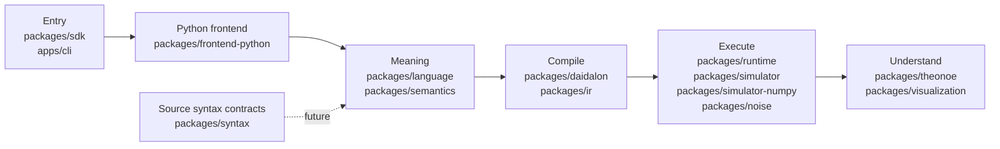
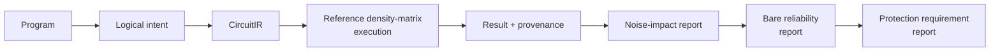

# Ariadion

[](https://github.com/redxe/ariadion/actions/workflows/ci.yml)
[](https://github.com/redxe/ariadion/actions/workflows/ci.yml)
[](https://github.com/redxe/ariadion/tree/v0.1.0rc1)

Ariadion is a Python-first quantum programming platform focused on preserving intent, execution evidence, and inspectable provenance through compilation and simulation.

> Status: **technical release candidate (`0.1.0rc1`)**. This is not a production `1.0` release.

## Why Ariadion exists

Many quantum tools make circuit construction and execution approachable, but it is still easy to lose the thread between:

- original program intent;
- compiler decisions;
- backend and noise assumptions;
- execution provenance;
- evidence supporting reliability conclusions.

Ariadion treats those relationships as first-class, inspectable contracts rather than implicit side effects.

## What exists today

| Area | Current capability (implemented) |
| --- | --- |
| Programming and semantics | Python source capture without executing the quantum function body; `LogicalModule` and typed semantic contracts; invocation expansion; lifetime and release analysis. |
| Compilation | Daidalon compiler; allocation and readout planning; `CircuitIR`; logical-operation provenance. |
| Execution | Explicit backend selection; reference and optional NumPy state-vector execution; sampled trajectories; density-matrix execution; scheduling; gate, idle/T1/T2, and readout noise. |
| Evidence and understanding | Immutable results; source-to-operation provenance; execution traces where supported; Theonoe state and transition inspection; noise-impact reports; model-relative bare-reliability reports; derived protection-requirement reports. |
| Interfaces and quality | Public Python SDK; CLI demo path; deterministic JSON reports; 415-test suite; Python 3.11/3.12 CI; clean-wheel installation smoke tests. |

## Architecture at a glance



The Python frontend (`packages/frontend-python`) is the currently implemented source-to-semantics path. `packages/syntax` currently contains syntax-node and token contracts, not a lexer or parser. It remains separate from the active Python frontend path; any future integration with that path is deferred.

Source intent remains separate from compiler choices, numerical realization, and explanation artifacts.

## Five-minute quick start

From the repository root using the documented `uv` workspace flow:

```bash
uv sync --all-packages
uv run python tools/run_example.py examples/bell.py
uv run ariadion demo bell
uv run python tools/test.py
```

Release-candidate installability smoke checks:

Each destination must be absent or empty — the tool rejects populated wheelhouses by design. Use a new, uniquely named directory each time.

```bash
uv run python tools/release_smoke.py --wheelhouse build/smoke-base-$(date +%Y%m%d)-01
uv run python tools/release_smoke.py --wheelhouse build/smoke-numpy-$(date +%Y%m%d)-01 --with-numpy
```

Rerunning with the same non-empty destination will fail. Clear or rename the directory first.

## Small public API example

```python
from ariadion import Program, run

program = Program(2, name="bell")
program.h(0).cx(0, 1)

result = run(program)
probabilities = result.simulation.probabilities

assert abs(probabilities[0] - 0.5) < 1e-9
assert abs(probabilities[3] - 0.5) < 1e-9
```

Expected distribution for the Bell state is 0.5 on `|00>` and 0.5 on `|11>`.

## Evidence workflow

The complete supported noise-impact → bare-reliability → protection-requirement reporting path currently requires all of the following:

- a **reference density-matrix logical execution**;
- a **classical-only return shape**; and
- **at least one classical return leaf**.

Quantum-only and hybrid return shapes may produce unsupported report evidence, but they do not produce a supported bare-reliability verdict. State-vector, sampled, NumPy-backend, and arbitrary-backend results support result inspection and provenance, but do not feed the complete supported reporting path today.



Sequence summary (reference density-matrix logical path):

1. Define program intent.
2. Capture and compile into logical and IR artifacts.
3. Execute with an explicit `DensityMatrixExecutionRequest` using the reference backend.
4. Inspect immutable results and provenance.
5. Derive a noise-impact explanation from the ideal-vs-noisy comparison.
6. Derive a bare-reliability estimate against an explicit `ReliabilityGoal`.
7. Derive a protection-requirement report from that bare-reliability evidence.

The protection-requirement report produces one of three outcomes:

- **NO_PROTECTION_REQUIRED** — Supported evidence is not **VIOLATED**. This includes **SATISFIED** and the within-tolerance **NOT_EVALUATED** case.
- **PROTECTION_REQUIRED** — Supported evidence is **VIOLATED**.
- **NOT_ASSESSED** — The underlying bare-reliability evidence is **INCOMPLETE_MODEL**, **INDETERMINATE**, or **UNSUPPORTED**.

The report states whether modeled bare execution meets a stated goal. It does not design a QEC strategy. Explicit backend selection (state-vector, sampled, NumPy, density-matrix) remains a general execution capability documented separately in the specification and architecture.

Note: Mermaid diagrams render on GitHub. Support for package-index long-description rendering is deferred packaging work.

## Repository map

| Package | Role |
| --- | --- |
| `packages/core` | Shared identity and source-location contracts. |
| `packages/language` | Public language and builder-facing contracts. |
| `packages/frontend-python` | Safe Python AST capture frontend. |
| `packages/syntax` | Immutable source syntax contracts. |
| `packages/semantics` | Pre-allocation logical semantics and typed contracts. |
| `packages/daidalon` | Compiler and synthesis engine. |
| `packages/ir` | Semantic intermediate representation. |
| `packages/runtime` | Runtime orchestration and execution dispatch. |
| `packages/simulator` | Reference state-vector and exact density simulators. |
| `packages/simulator-numpy` | Optional NumPy `complex128` simulation backend. |
| `packages/noise` | Provider-neutral executable noise contracts. |
| `packages/theonoe` | Inspection and debugging engine. |
| `packages/sdk` | Public Python SDK (`ariadion`). |
| `packages/visualization` | Circuit and state visualization helpers. |
| `apps/cli` | CLI entrypoints and demo workflows. |

## Honest current boundaries

- Local simulation only.
- No hardware-provider integration yet.
- Backend selection is explicit rather than automatic.
- State-vector and density-matrix simulation scale exponentially.
- No encoded-QEC planner or protection-strategy recommender yet.
- Studio is future work.
- This release is a technical RC (`0.1.0rc1`), not production `1.0`.

## Project status and navigation

- Architecture: [docs/architecture.md](docs/architecture.md)
- Roadmap: [docs/roadmap.md](docs/roadmap.md)
- Specifications: [specs](specs)
- Research notes: [docs/research](docs/research)
- Contributing: [CONTRIBUTING.md](CONTRIBUTING.md)
- Changelog: [CHANGELOG.md](CHANGELOG.md)
- Release checklist: [docs/release-checklist.md](docs/release-checklist.md)
- RC tag: [v0.1.0rc1](https://github.com/redxe/ariadion/tree/v0.1.0rc1)
